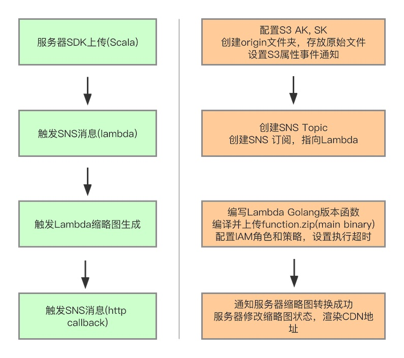
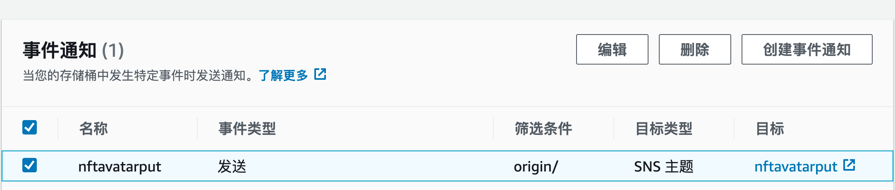
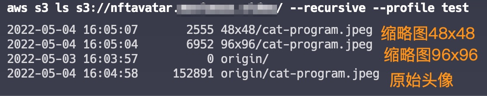

# Generate thumbnail on AWS

**Table of Contents**

- [Generate thumbnail on AWS](#)
  - [Workflow](#workflow)
  - [Setup AWS S3 bucket](#)
    - [Setup S3 subdirectory](#)
    - [Setup S3 Properities](#)
  - [Setup AWS SNS Topic for S3 origin image put](#)
  - [Setup AWS SNS Subscription for topic](#)
  - [Setup AWS Lambda function](#)
    - [Create AWS IAM Policy and Role](#)
    - [Create AWS Lambda function](#)
    - [Build AWS Lambda function](#)
    - [Upload AWS Lambda function](#)
  - [Upload Demo](#)

## Workflow



## Setup AWS S3 bucket

创建S3 bucket类似: nftavatar.domain.com

|字段|数值|说明|
|:-----|:------|:-----------------------------|
|bucketname | nftavatar.ascendex.io | |

### Setup S3 subdirectory
创建子目录: origin

|字段|数值|说明|
|:-----|:------|:-----------------------------|
|sub directory | origin | 存放上传的原始文件 |

### Setup S3 Properities
创建S3事件
|字段|数值|说明|
|:-----|:------|:-----------------------------|
|名称| nftavatarput |  |
|事件类型| 发送 | s3:ObjectCreated:Put |
|筛选条件| origin/ | origin目录上传的文件才进行转换 |
|目标类型| SNS主题|  |
|目标| nftavatarput | SNS Topic创建后绑定 |



## Setup AWS SNS Topic for S3 origin image put
创建AWS SNS主题
|字段|数值|说明|
|:-----|:------|:-----------------------------|
|topic name | nftavatarput| |
|ARN | arn:aws:sns:ap-northeast-1:566009277786:nftavatarput | 需要修改主题所有者<566009277786> |

访问策略json, 需要修改主题所有者<566009277786>
```json
{
  "Version": "2008-10-17",
  "Id": "__default_policy_ID",
  "Statement": [
    {
      "Sid": "__default_statement_ID",
      "Effect": "Allow",
      "Principal": {
        "AWS": "*"
      },
      "Action": [
        "SNS:Publish",
        "SNS:RemovePermission",
        "SNS:SetTopicAttributes",
        "SNS:DeleteTopic",
        "SNS:ListSubscriptionsByTopic",
        "SNS:GetTopicAttributes",
        "SNS:Receive",
        "SNS:AddPermission",
        "SNS:Subscribe"
      ],
      "Resource": "arn:aws:sns:ap-northeast-1:566009277786:nftavatarput",
      "Condition": {
        "StringEquals": {
          "AWS:SourceOwner": "566009277786"
        }
      }
    },
    {
      "Sid": "s3",
      "Effect": "Allow",
      "Principal": {
        "Service": "s3.amazonaws.com"
      },
      "Action": "SNS:Publish",
      "Resource": "arn:aws:sns:ap-northeast-1:566009277786:nftavatarput"
    }
  ]
}
```

## Setup AWS SNS Subscription for topic

创建AWS 主题订阅
|字段|数值|说明|
|:-----|:------|:-----------------------------|
|终端节点| arn:aws:lambda:ap-northeast-1:566009277786:function:ThumbnailGo | 修改主题所有者 |
|协议 | LAMBDA | |

## Setup AWS Lambda function

### Create IAM Policy and Role
创建IAM策略: AWSLambdaS3PolicyNFT

```json
{
    "Version": "2012-10-17",
    "Statement": [
        {
            "Sid": "VisualEditor0",
            "Effect": "Allow",
            "Action": [
                "s3:GetObject",
                "logs:CreateLogStream",
                "logs:CreateLogGroup",
                "logs:PutLogEvents"
            ],
            "Resource": [
                "arn:aws:logs:*:*:*",
                "arn:aws:s3:::nftavatar.ascendex.io/*"
            ]
        },
        {
            "Sid": "VisualEditor1",
            "Effect": "Allow",
            "Action": "s3:PutObject",
            "Resource": "arn:aws:s3:::nftavatar.ascendex.io/*"
        }
    ]
}
```

创建IAM Role:lambda-s3-role-nft, 并附加策略: AWSLambdaS3PolicyNFT

其信任关系json为
```json
{
    "Version": "2012-10-17",
    "Statement": [
        {
            "Effect": "Allow",
            "Principal": {
                "Service": [
                    "s3.amazonaws.com",
                    "lambda.amazonaws.com"
                ]
            },
            "Action": "sts:AssumeRole"
        }
    ]
}
```

基于git https://github.com/gdm-exchange/act-aws-lambda-s3.git
路径 lambda/ThumbnailGo 

### Create AWS Lambda function
|字段|数值|说明|
|:-----|:------|:-----------------------------|
|function-name| ThumbnailGo ||
|runtime| go1.x||
|handler|main||
|role |arn:aws:iam::566009277786:role/lambda-s3-role-nft|需修改所有者56xxxx|
```
aws lambda --profile test create-function --function-name ThumbnailGo --runtime go1.x \
  --zip-file fileb://function.zip --handler main  \
  --role arn:aws:iam::566009277786:role/lambda-s3-role-nft
```

### Build AWS Lambda function

```sh
GOOS=linux go build -ldflags "-s -w" main.go
zip function.zip main
```

### Upload AWS Lambda function
```sh
aws lambda --profile <devops-profile-name> update-function-code \
    --function-name  ThumbnailGo \
    --zip-file fileb://function.zip
```

## Upload Demo

1. 通过网页，或者服务端SDK，在origin目录上传cat-program.jpeg
2. 可以通过CloudWatch > Log groups > /aws/lambda/ThumbnailGo 看到日志事件，通过s3 cmd看到缩略图成功生成
```sh
aws s3 ls s3://nftavatar.ascendex.io/ --recursive --profile <devops-profile-name>
```


